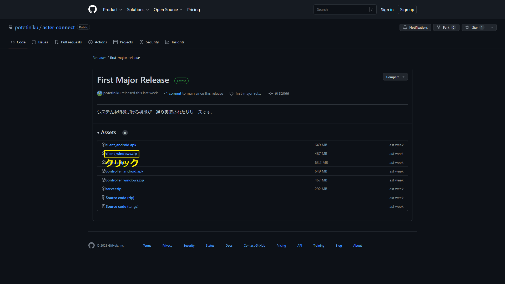

# Aster Connect ライブ視聴手順

この手順では、Aster Connectで配信されるライブを視聴する方法を説明します。

## 1. アプリをインストールする

常に最新版のリリース (2023/2/21時点では`First Major Release`) をご利用ください。

### Windowsで視聴する場合

[Aster Connectのリリースページ](https://github.com/potetiniku/aster-connect/releases/tag/first-major-release)からアプリケーション (`client_windows.zip`) をダウンロードしてください。

ダウンロードが終わったら、ダウンロードしたZIPファイルを解凍してください。

解凍したフォルダの中の`Aster Connect.exe`を実行するとアプリが起動します。

### Androidで視聴する場合

[Aster Connectのリリースページ](https://github.com/potetiniku/aster-connect/releases/tag/first-major-release)からアプリケーション (`client_android.apk`) をダウンロードしてください。

ダウンロードの際に警告が出る場合がありますが、その場合は無視してください。

ダウンロードが終わったら、[こちら](https://smartasw.com/archives/4011)などを参考にAPKファイルをインストールしてください。

## 2. ライブに参加する

アプリを起動するとタイトル画面が表示されます。

ユーザー名とサーバーのIPアドレスを各欄に入力してください。  
ユーザー名はコメントを書くときやエールを贈るときに使用されます。サーバーのIPアドレスは[こちら](https://gist.github.com/potetiniku/bf0d46237ea1c38c0ccb88775ab5c1f3)をご覧ください。

各項目を入力後、[参加する] を押すとライブに参加できます。  
本家同様、待機所を設けているので早めに来ていただいても構いません。

Android版ではライブに参加した際にマイクの使用許可を尋ねられますが、そのまま許可してください (実際に録音されることはありません)。