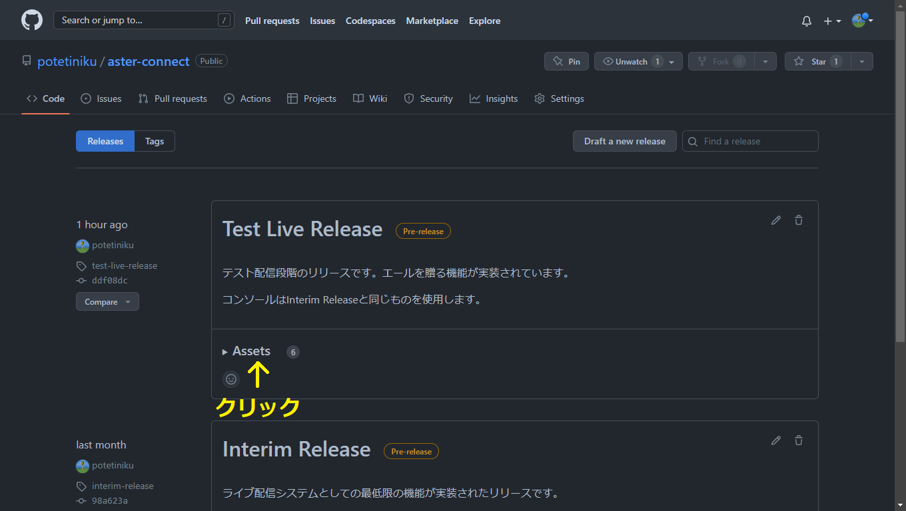
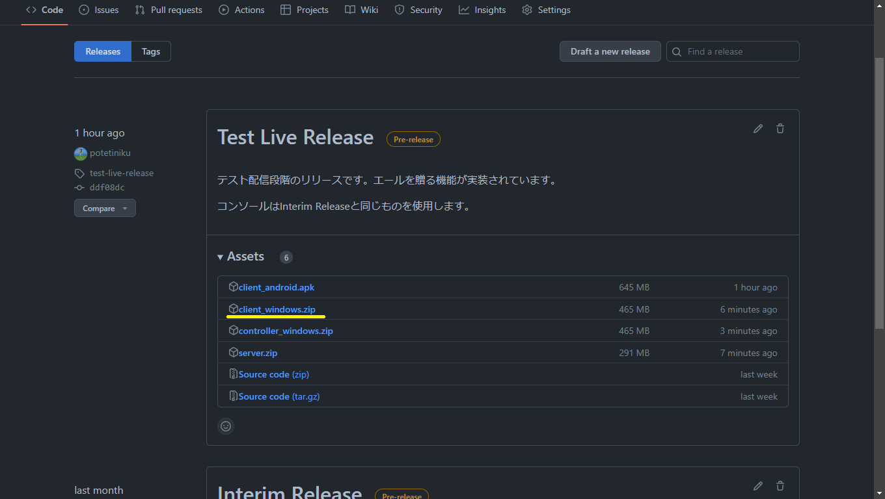

# Aster Connect ライブ視聴手順

この手順では、Aster Connectで配信されるライブを視聴する方法を説明します。

## 1-A. Windowsにアプリをインストールする

[Aster Connectのリリースページ](https://github.com/potetiniku/aster-connect/releases)からアプリケーション (`client_windows.zip`) をダウンロードしてください。  
2023/1/13時点では「Test Live Release」が最新版です。

ダウンロードが終わったら、ダウンロードしたZIPファイルを解凍してください。

解凍したフォルダの中の`Aster Connect.exe`を実行するとアプリが起動します。

## 1-B. Androidにアプリをインストールする

[Aster Connectのリリースページ](https://github.com/potetiniku/aster-connect/releases)または以下のQRコードからアプリケーション (`client_android.apk`) をダウンロードしてください。  
2023/1/13時点では「Test Live Release」が最新版です。

ダウンロードの際に警告が出る場合がありますが、その場合は無視してください。

ダウンロードが終わったら、[こちら](https://smartasw.com/archives/4011)などを参考にAPKをインストールしてください。

## 2. ライブを視聴する

アプリを起動するとタイトル画面が表示されます。

ユーザー名とサーバーのIPアドレスを各欄に入力してください。  
ユーザー名はコメントを書くときやエールを贈るときに使用されます。サーバーのIPアドレスは[こちら](https://gist.github.com/potetiniku/011ef5785ac223a9760d66c89bc69cfb)をご覧ください。

各項目を入力後、[参加する] を押すとライブに参加できます。  
本家同様、待機所を設けているので早めに来ていただいても構いません。