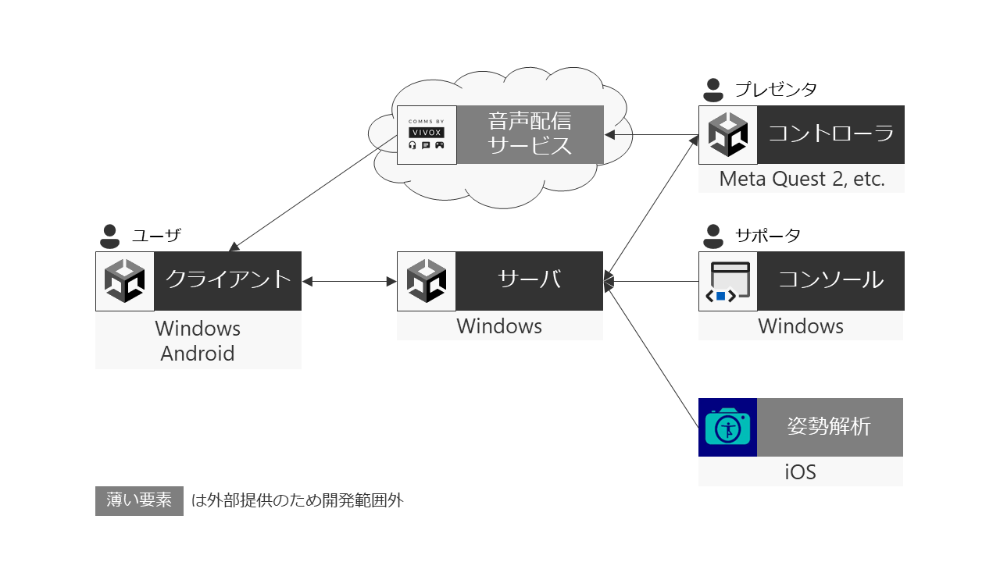
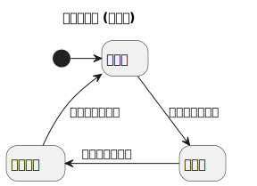

# Aster Connect 運用マニュアル

このマニュアルでは、Aster Connect (以下、「本システム」といいます) でライブを開始してから終了するまでの一連の手順を解説します。

## 用語

### 人物

プレゼンタとサポータは兼任しても構いません。

- ユーザ: ライブの視聴者。
- プレゼンタ: コントローラでアバターを動かす、ライブの中心となる人物。本家でいうアスタリスタ。
- サポータ: コンソールを使ってプレゼンタを補助する人物。

### ソフトウェア

- サーバ: システムの中心となるアプリケーション。
- クライアント: ライブを視聴するためのソフトウェア。ユーザが操作します。
- コントローラ: アバターの位置や状態を操作するアプリケーション。プレゼンタが操作します。
- コンソール: ライブを制御するために、サーバに指示を出すアプリケーション。サポータが操作します。

### ライブ要素

- ライブ: 本システム上で実施する生放送。
- ステージ: プレゼンタがライブをする空間。
- アバター: ステージ上に表示されるプレゼンタの3Dモデル。
- エール: ユーザがライブで贈れるオブジェクト。
- ランキングボード: ミニゲームで好成績を収めたユーザを掲載するボード。

## システムの状態

本システムには3つの状態があります。これらの状態はコンソールを操作して切り替えます。

- 停止中: サーバがコンソール以外からの通信を受け付けない状態です。
- 準備中: 運営がライブを準備する状態です。クライアントでは待機画面(本家でいう待機所)、コントローラではステージが表示されます。
- ライブ中: ライブが進行中の状態です。クライアント、コントローラの両方でステージが表示されます。

## 事前準備

### アプリケーションのインストール

最新版のアプリケーションを[リリースページ](https://github.com/potetiniku/aster-connect/releases)からダウンロードし、各機器にインストールしてください。一番上に表示されているリリースが最新版です。バージョンが揃っていないと正しく動かないので注意してください。  
Windows上で動かすアプリケーションはEXEファイルを起動するだけで使用できます。

| 名前                   | 役割         | OS      | 備考                                                         |
| ---------------------- | ------------ | ------- | ------------------------------------------------------------ |
| client_windows         | クライアント | Windows |                                                              |
| client_android.apk     | クライアント | Android | タブレット端末でも動作しますが、表示は崩れます。             |
| controller_windows     | コントローラ | Windows | VRデバイスがなくても動作します。                             |
| controller_android.apk | コントローラ | Android | Meta Quest 2などで使用します。                               |
| dedicatedServer        | サーバ       | Windows |                                                              |
| console                | コンソール   | Windows | [NET 6.0 Desktop Runtime](https://dotnet.microsoft.com/ja-jp/download/dotnet/6.0)が必要です。 |
| Pose Cam               | 姿勢解析     | iOS     | [App Store](https://apps.apple.com/jp/app/pose-cam/id1555012109)からインストールしてください。 |

### ネットワーク設定

サーバをインターネットに接続できる状態にしてください。  
また、ライブをインターネット上で公開する場合は、ルータとファイアウォールで以下の通信を許可してください。

- TCP/5239
- UDP/5239
- UDP/39828以降、プレゼンタの人数分
	- 例えば、プレゼンタが3人の場合はUDP/39828からUDP/39830まで

### Pose Camの購読

プレゼンタの姿勢解析に用いるPose Camは、サブスクリプション制の有料サービスです。  
プレゼンタはPose Camを起動し、画面の指示に従って購入手続きをしてください。

## ライブを開始する

### システムの状態を準備中にする

サポータが操作してください。

1. コンソールを起動してください。
2. [ライブ] > [サーバー設定…] を押して、サーバのIPアドレスを入力してください。
3. [ライブ] > [ライブを準備] を押してください。

### プレゼンタがステージに入る

プレゼンタが操作してください。

1. コントローラを起動してください。
2. [接続する] を押してください。
3. Pose Camを接続するように指示されます。Pose Camを起動してください。
4. 右上の設定アイコンを押してください。
5. [Network settings] > [Hostname] にサーバのIPアドレス、[Network settings] > [Port] に表示された番号を入力してください。
6. ダイアログの外側を押し、設定画面を閉じてください。
7. `tap to pair device`と表示されます。画面中央を押してください。
8. 接続に成功した場合、`tap to stream`と表示されます。画面中央を押してください。
9. 姿勢の撮影が始まります。体が画面に収まるようにiOS端末を設置してください。
10. コントローラに戻り、ダイアログを閉じてください。
11. 心の準備ができたら、次の手順に進んでください。

### ライブを開始する

コンソールから [ライブ] > [ライブを開始] を押してください。

## ライブを終了する

コンソールから [ライブ] > [ライブを終了] を押してください。